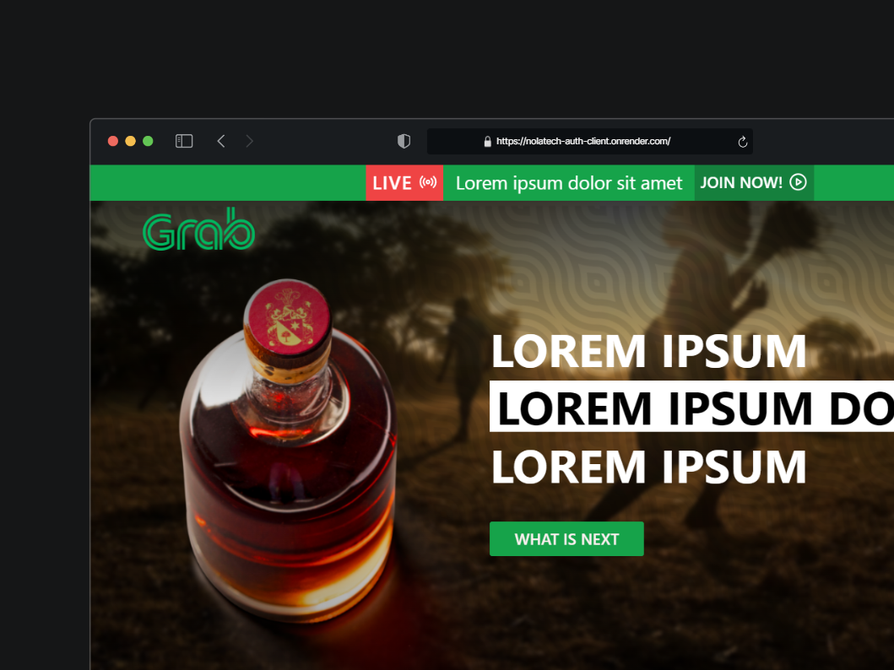

# Repositorio Front de la Prueba Técnica 🚀


El proyecto consiste en una landing page que además incluye un formulario de autenticación (Iniciar sesión y registrarse), diseñado para demostrar una implementación efectiva de modernas tecnologías web.



## Módulos 📚

El proyecto se estructura en los siguientes módulos principales:

- **Home** 🏠: La vista principal que muestra la landing page.
- **Login** 🔑: Permite a los usuarios iniciar sesión con sus credenciales.
- **Register** 📝: Proporciona un formulario para registrar nuevos usuarios.
- **Dashboard** 📊: Muestra información relevante a los usuarios registrados.

## Tecnologías Utilizadas 🛠

Este proyecto hace uso de las siguientes tecnologías y librerías:

- **React**: Utilizado para construir la interfaz de usuario con componentes reutilizables.
- **React Router Dom**: Maneja el enrutamiento en la aplicación.
- **Shadcn/ui**: Proporciona componentes de UI para React.
- **Axios**: Facilita las peticiones HTTP.
- **React Hook Form**: Simplifica la gestión de formularios.
- **zod**: Utilizado para la validación de formularios.
- **Tanstack/react-query**: Maneja el estado y la sincronización de datos.
- **Zustand**: Una alternativa ligera para el manejo del estado.
- **Tailwindcss**: Framework de CSS para un diseño rápido y responsivo.

## 🚀 Instalación y Uso

Sigue estos pasos para instalar y correr el proyecto:

### Clonar el repositorio

```bash
git clone URL_DEL_REPOSITORIO
```

### Instalar las dependencias

```bash
npm install
```

### Iniciar el proyecto

```bash
npm start
```

### Compilar para producción

```bash
npm run build
```

### Modo de desarrollo

```bash
npm run dev
```
